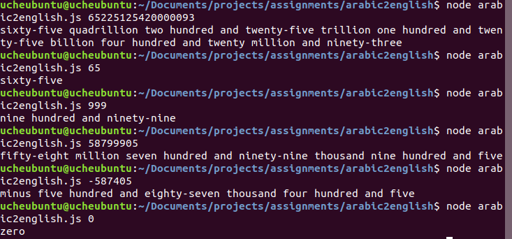

# arabic2english Numerals Converter 🔄

This converter provides the written names for numbers (arabic
numerals). For instance, 11 becomes 'eleven'.



## Usage

This package requires [NodeJS](https://nodejs.org) and
[npm](https://www.npmjs.com).

Clone the repository to your local machine using:

```
git clone https://github.com/CodeWithOz/arabic2english.git
```

Change into the newly created folder using:

```
cd arabic2english/
```

Run the `arabic2english.js` script using the `node` command, passing
the desired number as the first argument:

```
$ node arabic2english.js 65
sixty-five
```

#### Limitations

The parser:

- Only goes up to the quadrillions, although higher
  numbers can easily be extended. See the
  [Larger Than Quadrillions](#larger-than-quadrillions) section
  for more information.
- Only handles digits. Except for the minus sign at the beginning
  of the number (eg -908), no other non-digit characters are supported.
  Comma-formatted numbers (eg. 100,090) will yield unexpected results.

## Developer set up

After cloning the repository, run `npm install` to install all
dependencies.

#### Larger Than Quadrillions

To handle numbers larger than quadrillions, extend the `setsMap`
object in the file (currently) located at
`./helpers/largeNumbersParser/index.js` by adding more keys from `7`
and above. The parser will use your provided name(s) appropriately.

#### Testing

[Jest](https://jestjs.io) is required to run the tests. With Jest
installed, run `npm test` to see the test results.

**_Note_**: I used
[@babel/register](https://babeljs.io/docs/en/next/babel-register.html)
to ensure compatibility of ES6 imports/exports with NodeJS' cli.
Therefore, your terminal may display a nonsensical `console.log`
statement when you run `npm test`.
